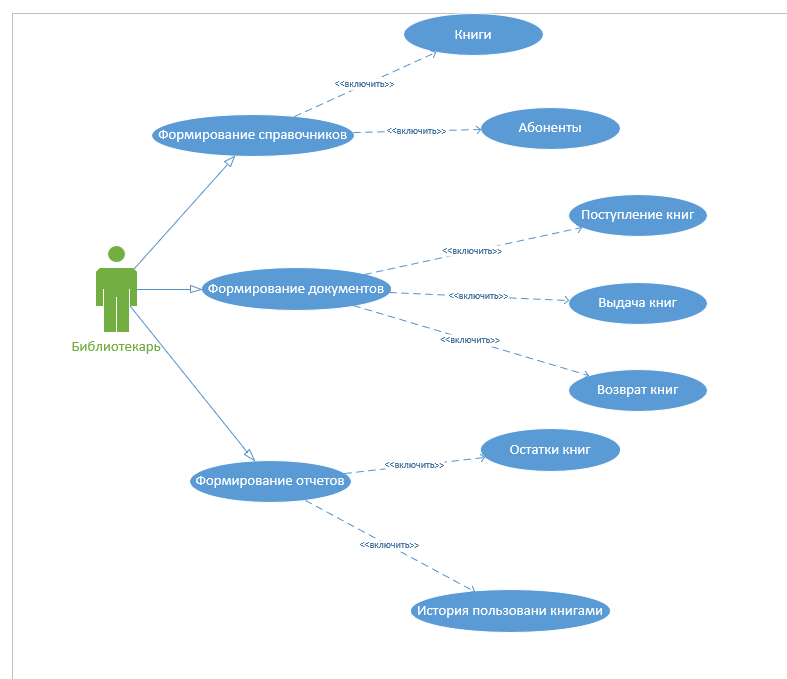
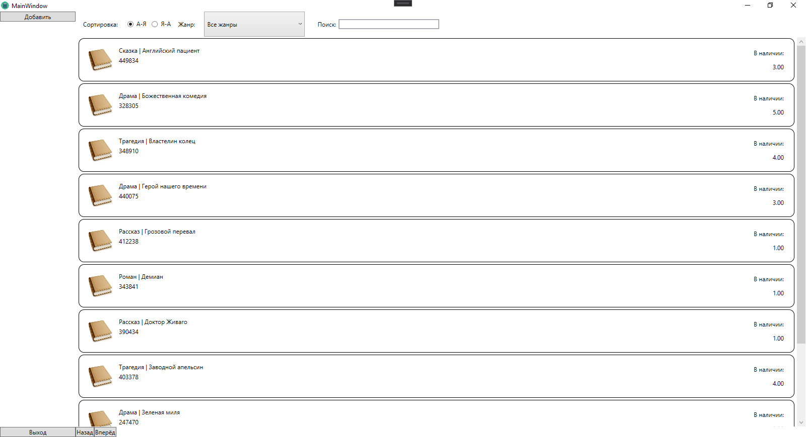
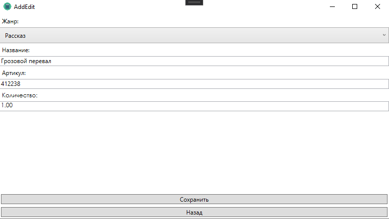

<table style="width: 100%;">
  <tr>
    <td style="text-align: center; borСпортr: none;"> 
        Министерство образования и науки РФ <br/>
        ГБПОУ РМЭ "Йошкар-Олинский Технологический колледж 
    </td>
  </tr>
  <tr>
    <td style="text-align: center; borСпортr: none; height: 45em;">
        <h2>
            Курсовой проект <br/>
            "Проектирование и разработка информационных систем" <br/>
            группа И-41
        <h2>
    </td>
  </tr>
  <tr>
    <td style="text-align: right; borСпортr: none; height: 20em;">
        <div style="float: right;" align="left">
            <b>Разработал</b>: <br/>
            Филатов Данил Николаевич  <br/>
        </div>
    </td>
  </tr>
  <tr>
    <td style="text-align: center; borСпортr: none; height: 1em;">
        г.Йошкар-Ола, 2021
    </td>
  </tr>
</table>

<div style="page-break-after: always;"></div>

# Содержание

* [Введение](#Введение)
* [Структурный системный анализ](#Структурный-системный-анализ)
* [Разработка и реализация проекта базы данных](#Разработка-и-реализация-проекта-базы-данных)
* [Программирование](#Программирование)
* [Заключение](#Заключение)

# Введение

В современном обществе информация стала полноценным ресурсом производства, важным элементом социальной и политической жизни общества. Качество информации определяет качество управления.

В последнее время все больше предприятий сталкиваются с проблемой улучшения управляемости компании: улучшение контроля и ускорение бизнес- процессов, улучшение возможности их отслеживания, оптимизация рабочего времени, экономия трудозатрат, повышение производительности труда и так далее. Единственным способом реализации подобных задач является внедрение информационной системы.

Применение современных информационных технологий имеет важное значение для оптимизации внутренних процессов организации, оперативного доведения информации до исполнителей, улучшения взаимодействия подразделений и отдельных исполнителей в процессе работы с документами, контроля исполнения документов и поручений, поиска информации и определения стадии исполнения документов и их местонахождения, то есть, в конечном счете, способствует более оперативному и качественному решению вопросов, которым посвящены документы. Главное при этом - улучшение взаимодействия всех подразделений организации, повышение управляемости, а также достижение более высокой оперативности в работе.

Актуальность темы определяется тем, что информационные системы составляют в настоящее время основу компьютерного обеспечения информационных процессов, входящих практически во все сферы человеческой деятельности.

В настоящее время, несмотря на повышение компьютеризации общества, в общежитии до сих пор нет средств, позволяющих в достаточной мере
 
Автоматизировать процесс ведения документации и отчетности.

О своевременности и актуальности рассматриваемой проблемы говорит тот факт, что большую часть своего времени, заведующий библиотеке тратит на оформление различной документации и отчетов.

Выше - изложенное в целом определило цель исследования: повышение эффективности работы заведующего библиотеке за счет разработки и внедрения информационной системы.

Данная информационная система предназначена для хранения информации о книгах, о произведенных оплатах и, с возможностью внесения данных, выборки и изменения данных, вывода информации в необходимом формате.

Объект исследования: работа заведующего в библиотеке.

Предмет исследования: информационная система, автоматизирующая работу заведующего библиотеке.

В соответствии с поставленной целью в проекте определены следующие задачи исследования:

1.	На основе теоретического анализа литературы	и Internet-источников произвести анализ предметной области общежитие.

2.	Провести	функционально-ориентированное	проектирование информационной системы.

3.	Разработать инфологическую модель информационной системы.

4.	Спроектировать логическую структуру информационной системы.

5.	Разработать физическую структуру информационной системы.

6.	Разработать запросы и отчеты к информационной системе.

7.	Разработать интерфейс БД.

8.	Создать руководство пользователя.


# Структурный системный анализ

При разработке информационной системы «библиотека» было проведено обследование деятельности библиотеки по следующим источникам:

–	Заведующим были предоставлены необходимые нормативные документы по правилам занесения данных о книгах и их хранения.

–	литература и Internet-источники, описывающие работу библиотеки.

Таким образом, в результате обследования предметной области были определены следующие входные данные:

–	информация о посетителях,

–	информация о документах на внесение данных,

–	информация о платежах,

–	информация об условиях хранения книг.

К выходным данным относятся отчеты об оплатах за аренду книги, сведения о людях, сведения о свободных и занятых книгах, сведения о задолжников книг.

Для создания информационной модели библиотеки необходимо осуществить формальное описание его работы. Изучение руководящих документов является первым шагом в изучении процессов работы библиотеки. Затем, на основе эталонных знаний, исследуется реальная работа заведующей библиотеки и сравнивается с указанием руководящих документов. Многократное изучение руководящих документов, периодическое наблюдение за реальными действиями заведующей и комментарии этого работника позволяют получить знания о функционировании работы библиотеки, разработать модели.

Читатель приходит в библиотеку. Библиотекарь проверяет оплату, правильно ли заполнена анкета, договор. Если все правильно он выдает книгу читателю. Всю информацию о нем он записывает в общий журнал. Процесс поиска данных связан с большой проверкой бумажных документов.

Целью решения данной задачи является сведение к минимуму работы работникам библиотеки с бумажными носителями, что ускорит процесс обработки поступающей информации, сократив время ожидания для читателя, исключит возможную путаницу информации.

### Диаграмма UseCase:


# Разработка и реализация проекта базы данных

ER-модель (от англ. Entity-Relationship moСпортl, модель «сущность — связь») — модель данных, позволяющая описывать концептуальные схемы предметной области.

ER-модель используется при высокоуровневом (концептуальном) проектировании баз данных. С её помощью можно выделить ключевые сущности и обозначить связи, которые могут устанавливаться между этими сущностями.

Во время проектирования баз данных происходит преобразование схемы, созданной на основе ER-модели, в конкретную схему базы данных на основе выбранной модели данных (реляционной, объектной, сетевой или др.).

ER-модель представляет собой формальную конструкцию, которая сама по себе не предписывает никаких графических средств её визуализации. В качестве стандартной графической нотации, с помощью которой можно визуализировать ER-модель, была предложена диаграмма «сущность-связь» (англ. Entity-Relationship diagram, ERD, ER-диаграмма).
Понятия «ER-модель» и «ER-диаграмма» часто не различают, хотя для визуализации ER-моделей могут быть использованы и другие графические нотации, либо визуализация может вообще не применяться (например, использоваться текстовое описание).

Модель была предложена в 1976 году Питером Ченом, им же предложена и самая популярная графическая нотация для модели.

Схема «сущность-связь» (также ERD или ER-диаграмма) — это разновидность блок-схемы, где показано, как разные «сущности» (люди, объекты, концепции и так далее) связаны между собой внутри системы. ER-диаграммы чаще всего применяются для проектирования и отладки реляционных баз данных в сфере образования, исследования и разработки программного обеспечения и информационных систем для бизнеса. ER-диаграммы (или ER-модели) полагаются на стандартный набор символов, включая прямоугольники, ромбы, овалы и соединительные линии, для отображения сущностей, их атрибутов и связей. Эти диаграммы устроены по тому же принципу, что и грамматические структуры: сущности выполняют роль существительных, а связи — глаголов.

Символы и способы нотации ERD.

Диаграммы «сущность-связь» (или ERD) — неотъемлемая составляющая процесса моделирования любых систем, включая простые и сложные базы данных, однако применяемые в них фигуры и способы нотации могут запросто ввести в заблуждение любого. Это руководство поможет вам стать настоящим экспертом по нотации ER-диаграмм и уверенно взяться за моделирование собственных баз данных!

Концептуальные модели данных дают общее представление о том, что должно входить в состав модели. Концептуальные ER-диаграммы можно брать за основу логических моделей данных. 

### ERD:


# Программирование

#### Главное окно:


##### Код разметки окна:
```xml
<Grid>

        <Grid.ColumnDefinitions>
            <ColumnDefinition Width="150"/>
            <ColumnDefinition Width="*"/>
        </Grid.ColumnDefinitions>

        <StackPanel 
            Orientation="Vertical"
            VerticalAlignment="Top"
            Width="150">
            <Button 
                x:Name="AddButton"
                Content="Добавить"
                Click="AddButton_Click"
                VerticalAlignment="Top"/>
        </StackPanel>
        <Button  
            x:Name="Exit" 
            Content="Выход" 
            Click="Exit_Click" 
            VerticalAlignment="Bottom"/>

        <Grid Grid.Column="1">
            <Grid.RowDefinitions>
                <RowDefinition Height="auto"/>
                <RowDefinition Height="*"/>
                <RowDefinition Height="auto"/>
            </Grid.RowDefinitions>

            <WrapPanel 
                Orientation="Horizontal"
                ItemHeight="50">

                <Label 
                    Content="Сортировка: "
                    Margin="10,0,10,0"
                    VerticalAlignment="Center"/>

                <RadioButton
                    GroupName="Rooms"
                    Tag="1"
                    Content="А-Я"
                    IsChecked="True"
                    Checked="RadioButton_Checked"
                    VerticalAlignment="Center"
                    Margin="0 0 10 0"/>
                <RadioButton
                    GroupName="Rooms"
                    Tag="2"
                    Content="Я-А"
                    Checked="RadioButton_Checked"
                    VerticalAlignment="Center"/>

                <Label 
                    Content="Жанр: "
                    Margin="10,0,10,0"
                    VerticalAlignment="Center"/>

                <ComboBox
                    x:Name="FilterTypeComboBox"
                    SelectedIndex="0"
                    VerticalContentAlignment="Center"
                    MinWidth="200"
                    MinHeight="10"
                    SelectionChanged="FilterTypeComboBox_SelectionChanged"
                    ItemsSource="{Binding ProductTypeList}">
                    <ComboBox.ItemTemplate>
                        <DataTemplate>
                            <TextBlock Text="{Binding Title}"/>
                        </DataTemplate>
                    </ComboBox.ItemTemplate>
                </ComboBox>


                <Label 
                    Margin="20 0 0 0"
                    Content="Поиск:" 
                    VerticalAlignment="Center"/>
                <TextBox
                    Width="200"
                    VerticalAlignment="Center"
                    x:Name="SearchFilterTextBox" 
                    KeyUp="SearchFilter_KeyUp"
                    BorderThickness="2"/>
            </WrapPanel>

            <ListView
                Grid.Row="1"
                ItemsSource="{Binding ProductList}"
                x:Name="ProductListView"
                BorderThickness="0"
                MouseDoubleClick="ProductListView_MouseDoubleClick">

                <ListView.ContextMenu>
                    <ContextMenu>
                        <MenuItem Cursor="Hand" Header="Удалить" x:Name="DeleteButton" Click="DeleteButton_Click"/>
                    </ContextMenu>
                </ListView.ContextMenu>

                <ListView.ItemContainerStyle>
                    <Style TargetType="ListViewItem">
                        <Setter
                            Property="HorizontalContentAlignment"
                            Value="Stretch" />
                    </Style>
                </ListView.ItemContainerStyle>

                <ListView.ItemTemplate>
                    <DataTemplate>
                        <Border 
                            BorderThickness="1" 
                            BorderBrush="Black" 
                            CornerRadius="10">
                            <Grid 
                                Margin="10"
                                HorizontalAlignment="Stretch">
                                <Grid.ColumnDefinitions>
                                    <ColumnDefinition Width="64"/>
                                    <ColumnDefinition Width="*"/>
                                    <ColumnDefinition Width="100"/>
                                </Grid.ColumnDefinitions>

                                <Image
                                    Width="64" 
                                    Height="64"
                                    Source="{Binding Path=ImagePreview}" />

                                <Grid Grid.Column="1" Margin="5">
                                    <Grid.RowDefinitions>
                                        <RowDefinition Height="20"/>
                                        <RowDefinition Height="20"/>
                                        <RowDefinition Height="*"/>
                                    </Grid.RowDefinitions>

                                    <StackPanel Orientation="Horizontal">
                                        <TextBlock Text="{Binding ProductType.Title}" />
                                        <TextBlock Text=" | " />
                                        <TextBlock Text="{Binding Title}"/>
                                    </StackPanel>

                                    <TextBlock 
                                        Text="{Binding ArticleNumber}"
                                        Grid.Row="1"/>
                                </Grid>

                                <TextBlock 
                                    Text="В наличии:"
                                    Grid.Column="2"
                                    VerticalAlignment="Top"
                                    HorizontalAlignment="Right"
                                    Margin="10"/>

                                <TextBlock 
                                    Text="{Binding MinCostForAgent}"
                                    Grid.Column="2"
                                    VerticalAlignment="Bottom"
                                    HorizontalAlignment="Right"
                                    Margin="10"/>

                            </Grid>
                        </Border>
                    </DataTemplate>
                </ListView.ItemTemplate>

            </ListView>

            <StackPanel
                HorizontalAlignment="Left"
                Grid.Row="2"
                Orientation="Horizontal">
                <Button 
                    Content="Назад" 
                    Name="PrevPage"
                    Click="PrevPage_Click"/>
                <Button
                    Content="Вперёд"
                    Name="NextPage"
                    Click="NextPage_Click"/>
            </StackPanel>
        </Grid>

    </Grid>
```
##### Логика главного окна:

```cs
public partial class Product
    {
        public Uri ImagePreview
        {
            get
            {
                var imageName = Environment.CurrentDirectory + Image ?? "";
                return System.IO.File.Exists(imageName) ? new Uri(imageName) : new Uri("pack://application:,,,/picture.png");
            }
        }
    }
    public partial class MainWindow : Window, INotifyPropertyChanged
    {

        private IEnumerable<Product> _ProductList;

        private int _CurrentPage = 1;

        public event PropertyChangedEventHandler PropertyChanged;

        public int CurrentPage
        {
            get
            {
                return _CurrentPage;
            }
            set
            {
                if (value > 0)
                {
                    if ((_ProductList.Count() % 10) == 0)
                    {
                        if (value <= _ProductList.Count() / 10)
                        {
                            _CurrentPage = value;
                            Invalidate();
                        }
                    }
                    else
                    {
                        if (value <= (_ProductList.Count() / 10) + 1)
                        {
                            _CurrentPage = value;
                            Invalidate();
                        }
                    }
                }
            }
        }

        private string _SearchFilter = "";
        public string SearchFilter
        {
            get
            {
                return _SearchFilter;
            }
            set
            {
                _SearchFilter = value;
                if (PropertyChanged != null)
                {
                    PropertyChanged(this, new PropertyChangedEventArgs("ProductList"));
                }
            }
        }

        private void SearchFilter_KeyUp(object sender, KeyEventArgs e)
        {
            SearchFilter = SearchFilterTextBox.Text;
            Invalidate();
        }

        private bool _SortList = true;
        public bool SortList
        {
            get
            {
                return _SortList;
            }
            set
            {
                _SortList = value;
                if (PropertyChanged != null)
                {
                    PropertyChanged(this, new PropertyChangedEventArgs("ProductList"));
                }
            }
        }

        private void RadioButton_Checked(object sender, RoutedEventArgs e)
        {
            SortList = (sender as RadioButton).Tag.ToString() == "1";
        }

        private void Invalidate()
        {
            PropertyChanged?.Invoke(this, new PropertyChangedEventArgs("ProductList"));
            PropertyChanged?.Invoke(this, new PropertyChangedEventArgs("CurrentPage"));
        }

        public IEnumerable<Product> ProductList
        {
            get
            {
                var Result = _ProductList;

                if (_ProductTypeFilterValue > 0)
                    Result = Result.Where(ai => ai.ProductTypeID == _ProductTypeFilterValue);

                if (SearchFilter != "")
                    Result = Result.Where(ai => ai.Title.IndexOf(SearchFilter, StringComparison.OrdinalIgnoreCase) >= 0);

                if (SortList) Result = Result.OrderBy(ai => ai.Title);
                else Result = Result.OrderByDescending(ai => ai.Title);

                return Result.Skip((CurrentPage - 1) * 10).Take(10);


            }
            set
            {
                _ProductList = value;

                if (PropertyChanged != null)
                {
                    PropertyChanged(this, new PropertyChangedEventArgs("ProductList"));
                }
            }
        }

        public IEnumerable<Product> ProductsList
        {
            get
            {
                var Result = _ProductList;

                if (SearchFilter != "")
                    Result = Result.Where(ai => ai.Title.IndexOf(SearchFilter, StringComparison.OrdinalIgnoreCase) >= 0);

                return Result;
            }
            set
            {
                _ProductList = value;
            }
        }

        public List<ProductType> ProductTypeList { get; set; }

        private int _ProductTypeFilterValue = 0;
        public int ProductTypeFilterValue
        {
            get
            {
                return _ProductTypeFilterValue;
            }
            set
            {
                _ProductTypeFilterValue = value;
                if (PropertyChanged != null)
                {
                    PropertyChanged(this, new PropertyChangedEventArgs("ProductList"));
                }
            }
        }
        public MainWindow()
        {
            InitializeComponent();
            DataContext = this;
            ProductList = Core.DB.Product.ToArray();
            ProductTypeList = Core.DB.ProductType.ToList();
            ProductTypeList.Insert(0, new ProductType { Title = "Все жанры" });
        }


        private void Exit_Click(object sender, RoutedEventArgs e)
        {
            Application.Current.Shutdown();
        }

        private void PrevPage_Click(object sender, RoutedEventArgs e)
        {
            CurrentPage--;
        }

        private void NextPage_Click(object sender, RoutedEventArgs e)
        {
            CurrentPage++;
        }

        private void AddButton_Click(object sender, RoutedEventArgs e)
        {
            var addWindow = new AddEdit(new Product());
            if (addWindow.ShowDialog() == true)
            {
                ProductList = Core.DB.Product.ToArray();
            }

        }

        private void ProductListView_MouseDoubleClick(object sender, System.Windows.Input.MouseButtonEventArgs e)
        {
            var EditTourWindow = new AddEdit(ProductListView.SelectedItem as Product);
            if (EditTourWindow.ShowDialog() == true)
            {
                ProductList = Core.DB.Product.ToArray();
            }
        }

        private void RefreshButton_Click(object sender, RoutedEventArgs e)
        {
            var w = new MainWindow();
            w.Show();

            this.Close();
        }

        private void DeleteButton_Click(object sender, RoutedEventArgs e)
        {
            var DeleteProduct = ProductListView.SelectedItem as Product;
            try
            {
                Core.DB.Product.Remove(DeleteProduct);
                Core.DB.SaveChanges();

                MessageBox.Show($"Удалено!");

                ProductList = Core.DB.Product.ToArray();

                if (PropertyChanged != null)
                {
                    PropertyChanged(this, new PropertyChangedEventArgs("ProductList"));
                }
            }
            catch { }

        }

        private void FilterTypeComboBox_SelectionChanged(object sender, SelectionChangedEventArgs e)
        {
            ProductTypeFilterValue = (FilterTypeComboBox.SelectedItem as ProductType).ID;
        }
    }
}
```

#### Окно редактирования:


##### Код разметки окна:
```xml
<Grid>
        <StackPanel>
            <Label Content="Жанр:"/>
            <ComboBox
                ItemsSource="{Binding productTypesss}"
                SelectedItem="{Binding CurrentProduct.ProductType}">
                <ComboBox.ItemTemplate>
                    <DataTemplate>
                        <Label Cursor="Hand" Content="{Binding Title}"/>
                    </DataTemplate>
                </ComboBox.ItemTemplate>
            </ComboBox>
            <Label 
                Content="Название:"/>
            <TextBox 
                Height="20"
                Text="{Binding CurrentProduct.Title}"/>
            <Label 
                Content="Артикул:"/>
            <TextBox 
                Height="20" 
                Text="{Binding CurrentProduct.ArticleNumber}"/>
            <Label 
                FontFamily="Century Gothic"
                Content="Количество:"/>
            <TextBox 
                FontFamily="Century Gothic"
                Height="20"
                Text="{Binding CurrentProduct.MinCostForAgent}"
                Cursor="IBeam"/>
        </StackPanel>
        <StackPanel 
                VerticalAlignment="Bottom">

            <Button
                x:Name="SaveButton" 
                Content="Сохранить"
                Click="SaveButton_Click"
                Margin="3"/>
            <Button 
                x:Name="BackButton"
                Content="Назад"
                Click="BackButton_Click"
                Margin="3"/>
        </StackPanel>
    </Grid>
```

```cs
public partial class AddEdit : Window
    {
        public static dfilatovEntities DB = new dfilatovEntities();
        public Product CurrentProduct { get; set; }
        public IEnumerable<ProductType> productTypesss { get; set; }


        public AddEdit(Product productsss)
        {
            InitializeComponent();
            DataContext = this;
            CurrentProduct = productsss;
            productTypesss = Core.DB.ProductType.ToArray();
        }
        private void SaveButton_Click(object sender, RoutedEventArgs e)
        {
            try
            {
                if (CurrentProduct.ProductType == null)
                    throw new Exception("Не выбран тип");

                if (CurrentProduct.ID == 0)
                    Core.DB.Product.Add(CurrentProduct);

                Core.DB.SaveChanges();

                DialogResult = true;

                MessageBox.Show($"Сохранено");
            }
            catch
            {
                MessageBox.Show($"Ошибка");
            }
        }

        private void BackButton_Click(object sender, RoutedEventArgs e)
        {
            this.Close();
        }
    }
}
```
# Заключение

В ходе выполнения курсового проекта средствами MySQL была разработана информационная система «Библиотека», предназначенная для автоматизации работы заведующей общежитием.

Концептуальная модель данных представлена диаграммой «сущность- связь». На ее основании разработана логическая структура базы данных, в ходе реализации которой задействованы механизмы обеспечения целостности данных.

Создание главной формы доступа к данным позволяет пользователям легко просматривать, обновлять или анализировать данные.

Разработанное приложение просто в применении и может быть использовано в любой библиотеке.

Запросы дают возможность извлечь нужную информацию по заданным критериям с необходимым упорядочиванием (выборки с сортировкой), сгруппировать данные и вычислить необходимые величины (групповые операции, отчеты с вычисляемыми полями).

Формы отображают информацию из таблиц в удобном виде, а также служат для ввода данных в таблицы.

Отчеты выводят информацию на печать в нужном формате и (при необходимости) с группировкой и итогами.

Сопоставление результатов проекта с поставленными задачами позволяет заключить следующее:

1.	На основе теоретического анализа литературы и Internet-источников произведен анализ предметной области общежитие.

2.	Проведено	функционально-ориентированное	проектирование информационной системы.

3.	Разработана инфологическая модель данных.

4.	Спроектирована логическая структура информационной системы.

5.	Разработана физическая структура информационной системы.

6.	Разработаны запросы, отчеты к информационной системе.

7.	Разработан интерфейс БД.

8.	Разработано руководство пользователя.


